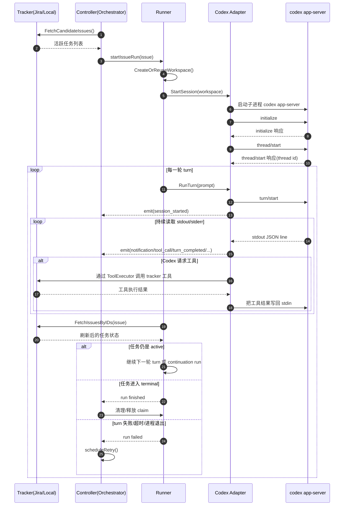
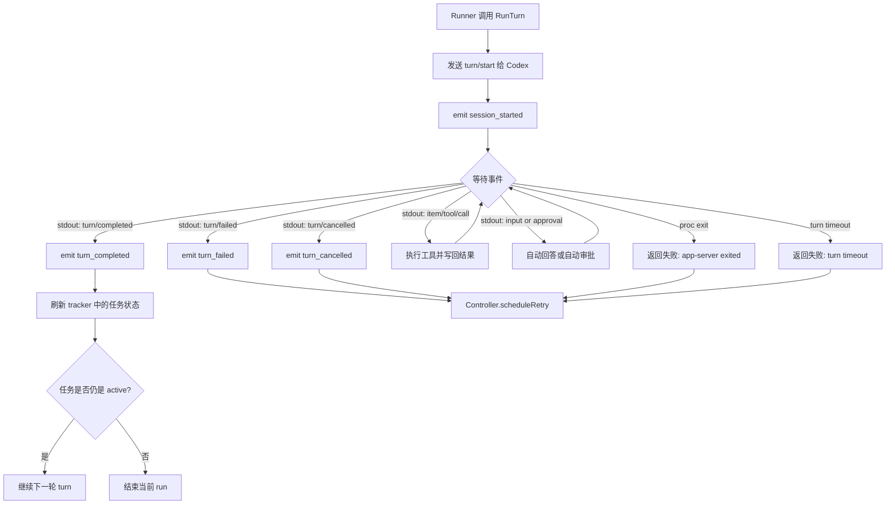
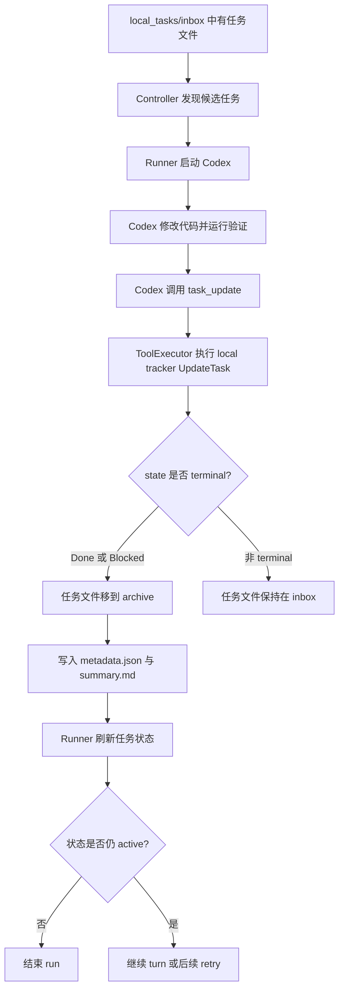
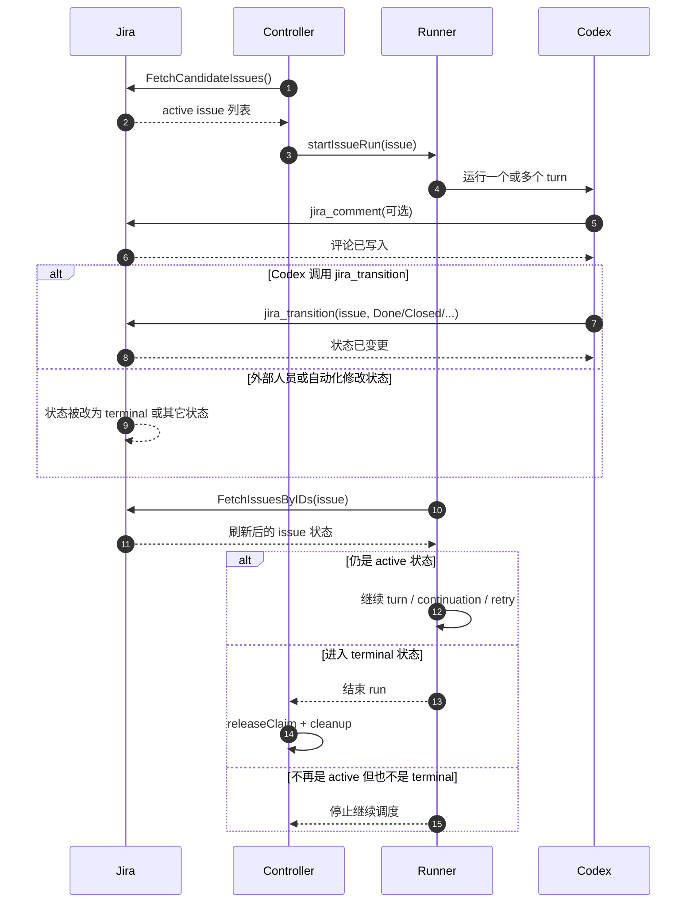
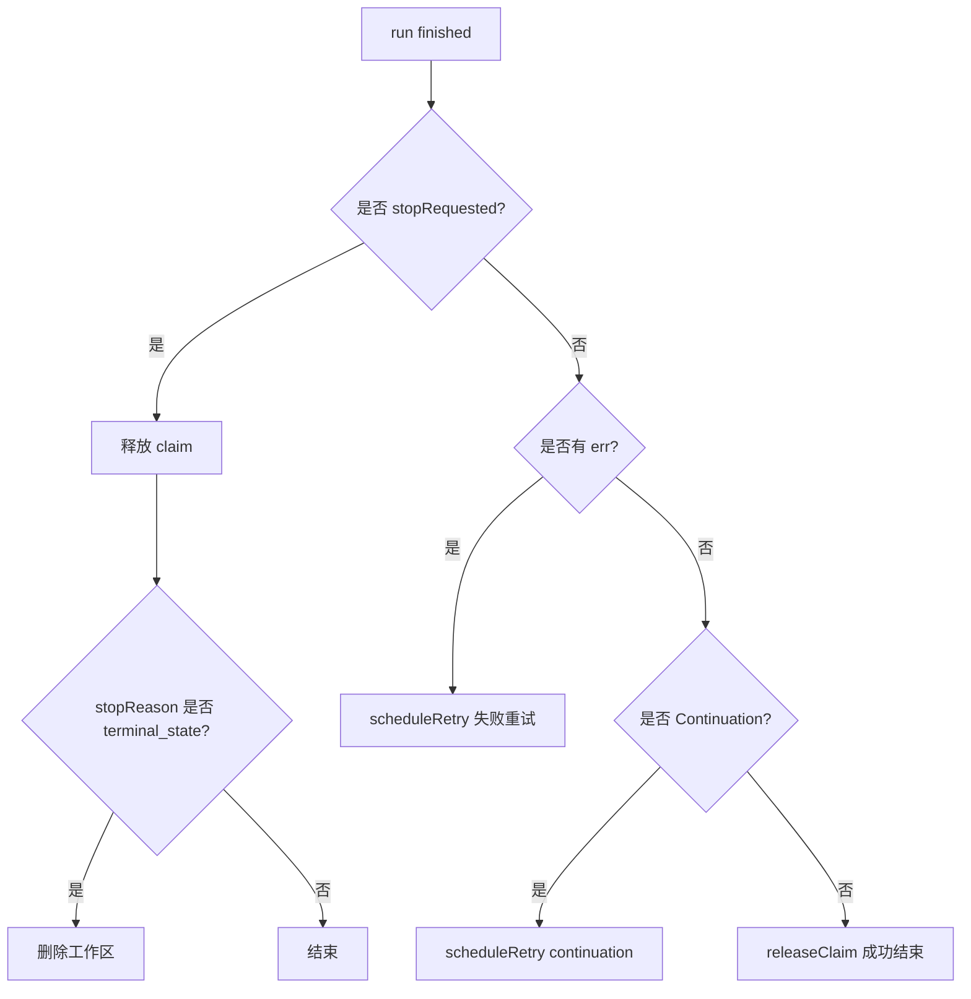

# Codex 状态反馈与 Symphony 调度流程

这份文档专门解释一个容易混淆的问题：

> `Codex` 是怎么把“我现在进行到哪了、成功了还是失败了、要不要继续”的状况反馈给 `symphony-go` 的？

如果你的 Markdown 预览器支持 Mermaid，可以直接看图；如果不支持，也可以看每张图后面的逐步说明。

## 一句话理解

`symphony-go` 并不会再调用一个大模型来“管理 Codex”。

它做的事情更像一个编排器：

- 启动 `codex app-server` 子进程
- 通过 `stdin/stdout` 和它交换 JSON 消息
- 把这些消息翻译成内部事件
- 根据任务状态决定继续、停止或重试
- 把整理后的状态暴露到 Dashboard、历史页和 API

也就是说：

- **Codex 负责干活与发事件**
- **Symphony 负责收事件、查状态、做调度**

## 角色分工

| 组件 | 作用 |
| --- | --- |
| `tracker` | 提供任务来源与任务状态，例如 Jira 或本地 Markdown 任务 |
| `workspace` | 为每个任务创建或复用独立工作区 |
| `agent/codexappserver` | 启动 `codex app-server`，并通过 stdio 与之通信 |
| `runner` | 对单个任务执行一轮或多轮 turn |
| `orchestrator/controller` | 轮询任务、调度运行、处理重试、维护内存快照 |
| `server` | 暴露 `Dashboard`、`/api/v1/state`、`/history`、`/events` 等接口 |

## 核心反馈通道

Codex 把状况反馈给 Symphony，主要通过下面四条通道：

### 1. `stdout` JSON：主反馈通道

这是最关键的一条。

`Symphony` 启动 `codex app-server` 后，会持续逐行读取它的 `stdout`。每一行如果是合法 JSON，就会被当成一条结构化消息处理。

这些消息通常表示：

- 某个请求的响应
- turn 已完成或失败
- 某个工具调用请求
- 某个审批请求
- 某个输入请求
- token usage 等信息

### 2. `stderr`：调试日志通道

`stderr` 也会被读取，但目前主要用于 debug log，不作为编排决策的主依据。

### 3. 进程退出与超时：故障反馈通道

如果 `codex app-server` 进程退出、某轮 turn 超时、或者通信被中断，`Symphony` 会把这次运行视为失败，并进入重试流程。

### 4. tracker 状态：业务结果通道

即使 `Codex` 说“这轮 turn completed”，`Symphony` 也不会立刻认定任务完成。

它还会再去 tracker 刷新任务状态：

- 如果任务仍是 active，就继续推进
- 如果任务已经进入 terminal，就停止

换句话说：

- `stdout` 告诉 Symphony：**Codex 这一轮运行得怎么样**
- `tracker` 告诉 Symphony：**业务任务现在是不是已经闭环**

## 总体时序图



### 图后说明

1. `controller` 轮询 tracker，找到处于 active 状态的任务。
2. `runner` 为该任务创建或复用工作区。
3. `agent/codexappserver` 启动 `codex app-server` 子进程。
4. `Symphony` 发 `initialize`、`thread/start`、`turn/start` 等 JSON 请求。
5. `Codex` 在 `stdout` 上持续输出 JSON 事件。
6. `Symphony` 解析这些事件，并转成内部 `agent.Event`。
7. 如果 Codex 请求工具，Symphony 会执行工具并把结果写回 Codex。
8. 一轮 turn 结束后，`runner` 会刷新任务状态，而不是只看 Codex 的“完成”信号。
9. 最后由 `orchestrator` 决定继续、停止还是重试。

## `Codex -> Symphony` 事件翻译图

下面这张图专门解释“Codex 的原始消息是怎么变成 Dashboard 上的状态”的。

```mermaid
flowchart TD
    A[Codex stdout 输出一行 JSON] --> B[adapter 逐行读取]
    B --> C[decodeJSONLine]
    C --> D{method 是什么?}

    D -->|turn/completed| E[emit turn_completed]
    D -->|turn/failed| F[emit turn_failed]
    D -->|turn/cancelled| G[emit turn_cancelled]
    D -->|item/tool/call| H[执行工具并回写结果]
    D -->|approval/input request| I[自动审批或自动回答]
    D -->|其它通知| J[emit notification]

    E --> K[Controller.onAgentEvent]
    F --> K
    G --> K
    H --> K
    I --> K
    J --> K

    K --> L[更新 running entry]
    L --> M[更新 LastEvent]
    L --> N[更新 LastMessage]
    L --> O[更新 Usage]
    L --> P[追加 Events 历史]
    L --> Q[如果是 session_started 则 Turns+1]
    L --> R[生成 Snapshot]
    R --> S[/api/v1/state]
    R --> T[/events SSE]
    R --> U[/history 页面与 API]
```

### 关键点

- `Codex` 发出来的是**原始协议消息**。
- `agent/codexappserver` 会把这些原始消息翻译成 `agent.Event`。
- `controller` 再把 `agent.Event` 汇总进内存中的运行状态。
- UI 和 API 读到的是 `controller.Snapshot()` 整理后的结果，而不是 `Codex stdout` 原文。

## 单个 turn 的详细流程图



### 单个 turn 的判断逻辑

#### 分支 A：`turn/completed`

这只说明：

- 当前这轮 agent turn 正常结束了

它**不自动等于**：

- 任务完成了
- tracker 已经变成终态

所以 `runner` 还会刷新任务状态：

- 如果任务还是 active，就继续下一轮 turn
- 如果任务不是 active，就结束 run

#### 分支 B：`turn/failed` / `turn/cancelled`

这说明当前 turn 没有正常完成。

这时 `controller` 不会“智能分析原因”，而是按策略进入 `scheduleRetry()`。

#### 分支 C：工具调用

如果 `Codex` 在运行中发出 `item/tool/call`：

1. `Symphony` 解析工具名和参数
2. 调用本地 `ToolExecutor`
3. 工具再去操作 tracker
4. 工具结果通过 `stdin` 写回 `Codex`
5. Codex 继续同一轮 turn

这就是 `Codex` 和 `Symphony` 的双向协作点。

## 本地任务模式的闭环图

本地模式最容易看懂，因为你能直接看到任务文件从 `inbox` 进入 `archive`，以及 `results` 目录里的输出。



### 这张图说明了什么

- 本地模式闭环的关键，不是“Codex 说我做完了”，而是“Codex 调用了 `task_update` 并把任务状态真正改掉了”。
- 一旦状态进入 terminal，下一次状态刷新时，`runner` 就会知道这个任务不该继续了。

## Jira 模式的闭环图

Jira 模式比本地模式多一个特点：

- `jira_comment` 只是回写说明，不会让任务自动结束
- `jira_transition` 或外部 Jira 流转，才会真正影响任务是否继续



### Jira 模式要点

- `jira_comment` 只是在 issue 上留下说明，通常不会改变 `active` / `terminal` 判断。
- `jira_transition` 会直接修改 issue 状态，因此是 Jira 模式里最直接的闭环工具。
- 即使 Codex 不主动 `jira_transition`，外部的人、自动化规则或 Jira workflow 也可以改变 issue 状态；`Symphony` 下一次 poll / reconcile 时会感知到。
- 如果配置了 `/api/v1/webhooks/jira`，外部状态变化可以更快触发刷新；否则也会被下一次定时轮询发现。

### Jira 模式下为什么任务可能一直继续

最常见的原因是：

- Codex 只调用了 `jira_comment`，没有把 issue 从 active 状态迁出
- Jira 工作流要求人工审核后才能流转到 terminal
- 你的 JQL 仍然会把这个 issue 选回来

所以在 Jira 模式里，真正决定 `Symphony` 停不停的，仍然是 **刷新后的 Jira issue 状态**，而不是评论内容本身。

## Symphony 到底是怎么判断继续、停止、重试的

可以把 `Symphony` 的调度决策理解成一个很小的状态机：



### 规则拆解

- **停止**：如果外部状态已经变成 terminal，运行中的任务会被取消并停止。
- **重试**：如果本轮运行报错，就按失败重试。
- **continuation**：如果没报错，但已经达到本次 run 的最大 turn 数，且任务仍 active，就发起 continuation retry。
- **成功结束**：如果没有错误，且任务状态不再 active，就结束。

## 重试与 continuation 的区别

这两个词看起来像一回事，但语义不同：

### 失败重试

触发条件：

- `codex app-server` 退出
- turn 失败
- turn 超时
- tracker 刷新失败

特点：

- 会重新启动一个新的 Codex session
- 会复用当前任务工作区
- 使用指数退避延迟

### continuation

触发条件：

- 本轮 run 正常执行完了
- 但是任务仍是 active
- 并且已经达到当前 run 的 `max_turns`

特点：

- 语义上不是失败，而是“这次 run 的额度用完了，但任务还没闭环”
- 会很快再次调度
- 仍然复用工作区

## Dashboard 和 API 看到的是什么

`Dashboard`、`/api/v1/state`、`/history`、`/events` 看到的不是 Codex 原始输出，而是 Symphony 整理好的快照。

### 快照里通常包含

- 当前正在运行的任务
- 每个任务的 `run_id`
- 当前 turn 数
- 最后一个事件类型
- 最后一条消息
- `Codex` 进程 PID
- token usage
- 重试队列
- 最近历史记录

### `/events` 是什么

`/events` 并不是把 `Codex stdout` 原样推给浏览器。

它是一个 SSE 接口，但推送内容是：

- `controller.Snapshot()` 生成的**整份状态快照**
- 默认每 2 秒推送一次

所以浏览器看到的是“当前整体状态”，而不是“某条底层协议事件”。

## 常见误解

### 误解 1：Codex 说 `turn completed` 就表示任务完成

不是。

`turn completed` 只表示：当前这轮 turn 正常结束。

任务是否真正完成，要看 tracker 状态是否已经变成 terminal。

### 误解 2：Symphony 会自己理解任务内容并决定下一步

也不是。

Symphony 的“继续推进”主要依赖：

- 当前 turn 是否成功
- 当前任务状态是否仍 active
- 是否到达最大 turn 数
- 是否触发重试条件

它不是一个再套一层大模型的 supervisor。

### 误解 3：Codex 停下来以后，Symphony 会自动总结并重新提示它

不完全是。

Symphony 只会：

- 在同一个 run 里发送 continuation prompt
- 或者在失败后重新拉起一个 Codex session
- 或者在下一次 poll / retry 中再次调度该任务

它不会自己进行复杂的语义诊断。

## 最后用一句最实用的话总结

如果你想判断一个任务为什么还在继续跑，优先看这三件事：

1. `Codex` 这轮 turn 是 `completed`、`failed` 还是 `timeout`
2. `Codex` 有没有真正调用 `task_update` / `jira_transition` 等写回工具
3. tracker 刷新后，这个任务是不是仍处于 active 状态

只要第 3 点还是“active”，`Symphony` 就会继续推动它。

## 相关代码入口

- `cmd/symphonyd/main.go`
- `internal/agent/agent.go`
- `internal/agent/codexappserver/client.go`
- `internal/runner/runner.go`
- `internal/orchestrator/controller.go`
- `internal/tools/executor.go`
- `internal/tracker/local/client.go`
- `internal/server/server.go`
- `internal/server/ui.go`

